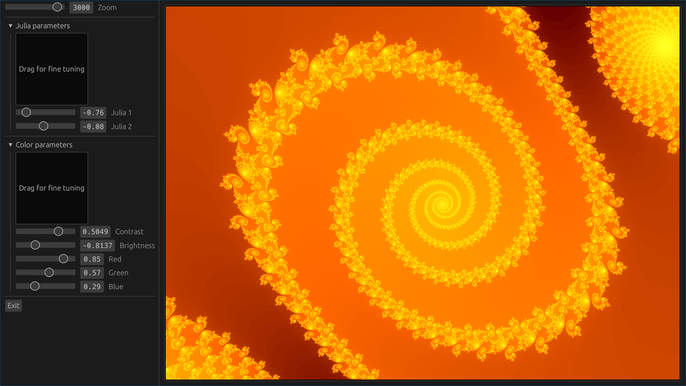

# FractalGl

A simple UI to generate fractals. It is a quick and dirty Project that I wrote to test game UIs on rust.

I reused the OpenGL shaders I wrote for a [previous project](https://github.com/Blizarre/jscripts/blob/master/fractal.html).

[Rust](https://www.rust-lang.org) + [egui](https://github.com/emilk/egui) + [glow](https://github.com/grovesNL/glow)

